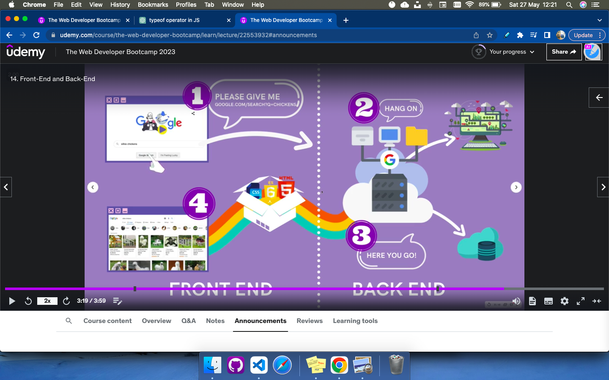
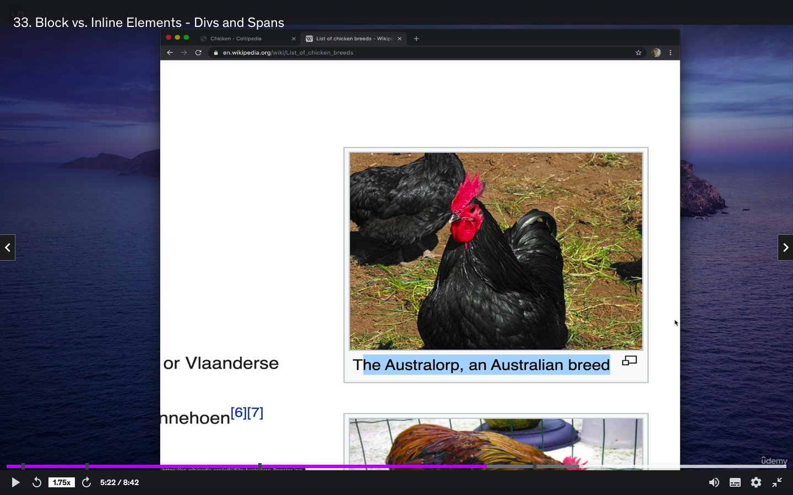

- [Interview Question InterviewBit](https://www.interviewbit.com/html-interview-questions/)
pdf file <mark>added</mark>


[Important Topics With Ranks](https://trello.com/b/0PVRE1XQ/web-developer-bootcamp)


## Live preview extension vs code to see live html

1. HTTP Protocol
2. Web Server
3. Client
4. Request and Response Cycle
5. FrontEnd and Backend



- Html css Js Calculator Online
https://codepen.io/giana/pen/GJMBEv

## tab to autocomplete in VS code


Html is not a programming language.
it is just a Markup Language.(just like this .md file)

1. HTML Elements:

- HTML elements are represented by tags enclosed in angle brackets (< >).
Each HTML element has an opening tag, content (optional), and a closing tag.
Some elements are self-closing and don't require a closing tag.
Elements can have attributes that provide additional information or functionality.

2. General Syntax
- '<p1<p1>> I am a paragraph </p</p>>'


### Creating a sample wikipedia page using only html

I have written an html file just like this markup file without any doctype or anything else

- Shortcut to write tags

type the tag eg. b1 -> hit tab


## Important Link

[Mozilla Developer Network](https://developer.mozilla.org/en-US/)

References --> Html
[Html Elements](https://developer.mozilla.org/en-US/docs/Web/HTML/Element)

OR
[W3Schools]

------

# Important Tags
1. Paragraph tag 
The <p> tag in HTML is used to define a paragraph. It is a <mark>block-level</mark> element that represents a section of text or content that forms a coherent and distinct unit.

- Can contain other types of content than text

```
<p>This is a paragraph of text.</p>
```

2. Header Tags
- Recommended- 
Should have only h1 tag per page

- Each heading takes it own line --> so any text in .html written after header simply goes to the next line.

- To get some random text type 'lorem' + hit tab
or lorem*3 *or lorem*6

- Recommeded - Should not have h3 h4 without having h1 and h2 so alwyas follow the order

```
<h1>This is heading 1</h1>
<h2>This is heading 2</h2>
<h3>This is heading 3</h3>
<h4>This is heading 4</h4>
<h5>This is heading 5</h5>
<h6>This is heading 6</h6>
```


- Chrome -> webpage -> right click -> inspect
We can find html code for each element 

Till now we wrote simply tags and made a doc but its is not valid.
we use...

## <u>Html Skeleton OR Html BoilerPlate</u>

- ! + tab (shortcut)
## To format the html doc automatically in vs code
- Optn + shift+f

OR 
- we can set to Auto Format in Settings(enabled this in my mac)

## 1 Head + 1 Body (only)

The ```<head>``` tag in HTML is used to define the head section of an HTML document. It contains meta-information about the document, including title, character encoding, linked CSS stylesheets, JavaScript scripts, and other **metadata that is not directly displayed on the webpage.**

Here are some common elements that can be included within the ```<head> ``` tag:

```<title>```: Specifies the title of the webpage, which is ***displayed in the browser's <u>title bar or tab.</u>***

```<meta charset="UTF-8">```: Defines the character encoding for the document (usually set to UTF-8 to support a wide range of characters and languages).

```<meta name="viewport" content="width=device-width, initial-scale=1.0">```: Sets the viewport properties for responsive design on different devices.
```<link rel="stylesheet" href="styles.css">```: Links an external CSS stylesheet to apply styles to the HTML document.
```<script src="script.js"></script>```: Links an external JavaScript file to add interactive functionality to the webpage.
```<meta name="description" content="A brief description of the webpage">```: Provides a short description of the webpage for search engine results and other purposes.
```<meta name="keywords" content="keyword1, keyword2, keyword3">```: Specifies the keywords relevant to the webpage's content for search engine optimization (SEO).


```
<!DOCTYPE html>
<html>
    <head>

    </head>

    <body>

    </body>

</html>
```

```
<!DOCTYPE html>  //Simply a flag
<html lang="en">  //Everything should come within the html flag
<head>
    <meta charset="UTF-8">
    <meta http-equiv="X-UA-Compatible" content="IE=edge">
    <meta name="viewport" content="width=device-width, initial-scale=1.0">
    <title>Document</title>
</head>
<body>
    <h1>Conditionals</h1>
    <script src="script.js"></script>
</body>
</html>
```


3. List

list can conatain only as their direct children
```
 <li> or <script> or <template>
```

but ```<li>``` can themselves have anything inside them (eg. nested list)


two types of lists numebred and bulleted

```<ol>``` (Ordered List):

```
<ol>
  <li>First item</li>
  <li>Second item</li>
  <li>Third item</li>
</ol>

```
```<ul>``` (Unordered List):

```
 <ul>
  <li>First item</li>
  <li>Second item</li>
  <li>Third item</li>
</ul>

 ```


 ## To copy a line in html Shortcut
 Shift + Optn +(Up or down arrow)


4. anchor tag

The ```<a>``` tag in HTML is used to create **hyperlinks or anchor links.** It allows you to create clickable links that can direct users to other webpages, sections within the same webpage, or external resources.

- href: The href attribute specifies the URL or destination where the link will navigate to. It can be a relative or absolute URL. For example, href="https://www.example.com" or href="page.html".
- Link Text: The link text is the visible text that users see on the webpage. It can be any text or content you want to display as the clickable link.

### Anchor tags are ***inline*** that is they do not take their own line like h1,h2 tags,
href is attribute and goes inside the ```<a href ="">``` 
```
<a href="URL">Link Text</a>
```

1. Link to an external webpage:

We need to write https because currently we were on the file protocol and not on https
```
<a href="https://www.google.com">Visit Google Website</a>
```
2. Link to another Webpage
```
<a href="subdirectory/about.html">About Page</a>

```
3. Link to a section within the same webpage:

```
<a href="#section-id">Jump to Section</a>
```

4. Link to an email address:

```
<a href="mailto:example@example.com">Send Email</a>
```

5. Link to a file download:

```
<a href="path/to/file.pdf" download>Download PDF</a>
```


5. Image Element

**No closing tag**
because no text in img
Recommendation --> Not a good practise to define height and width in html(do in css)

alt attribute --> to display the text in case of image not loading up


1. M1 -> From an image stored locally
```

```

2. M2 -> From url of an image

```


```


## Comments in html

1. ```<!-- -->```

2. Shortcut --> cmd + /


## Block Level Elements vs Inline Elements

In HTML, elements are categorized as either block-level elements or inline elements. This categorization determines how the elements are rendered and how they interact with other elements on the web page.

Block-level elements:

- Examples: ```<div>, <p>, <h1> to <h6>, <ul>, <li>, <section>, <article>, <header>, <footer>,``` etc.
- Key characteristics:
1. Starts on a new line.
2. Occupies the full available width of its parent container by default.
3. Can have width, height, margins, padding, and can be styled using CSS.
4. Can contain other block-level and inline elements.
5. Can be used to create major structural components of a web page.


Inline elements:

- Examples:``` <span>, <a>, <strong>, <em>, , <input>, <button>, <label>,``` etc.
- Key characteristics:
1. Does not start on a new line, but rather flows within the surrounding text or other inline elements.
2. Occupies only the necessary width based on the content it contains.
3. Generally cannot have width, height, margins, or padding directly applied to them.
4. Can be styled using CSS for properties like font styles, colors, etc.
5. Can contain ***only other inline elements or text nodes,*** not block-level elements.


Understanding the difference between block-level and inline elements is important for structuring and styling your web pages effectively. Block-level elements are typically used for creating larger sections and organizing the layout, while inline elements are used for small-scale styling and enhancing the content within the text flow.

*It's worth noting that the display behavior of elements can be modified using CSS properties such as display, allowing you to change a block-level element to behave as an inline element and vice versa.*


## div tag 


The ```<div>``` element in HTML is a generic container that is used to group and organize other elements.

```
<div>Content goes here</div>
```
- It provides a way to **group related elements together and apply common styling or functionality to them.**
- It acts as a **block-level container**, meaning it starts on a new line and occupies the full width of its parent container by default.

```
<div>
  <h1>Welcome to my website</h1>
  <p>This is the main content section.</p>
  <ul>
    <li>Item 1</li>
    <li>Item 2</li>
    <li>Item 3</li>
  </ul>
</div>

```



## Span tag

The ```<span>``` element in HTML is an inline-level element that is used to apply styling or add additional markup to a specific section of text or inline content.

- <span> can be used to apply CSS styles, such as color, font size, or background color, to a specific part of a text or inline content.

<p>This is a <span style="color: red;">highlighted</span> word in a paragraph.</p>

```
<p>This is a <span style="color: red;">highlighted</span> word in a paragraph.</p>

<p>Click <span onclick="myFunction()">here</span> to perform an action.</p>
```


Media heading


```<hr>``` Tag

The ```<hr>``` tag in HTML is a ***self-closing tag*** that represents a horizontal rule or a thematic break in the content. It is commonly used to visually separate sections or elements within a webpage. 
- The``` <hr>``` tag does not require a closing tag as it is a self-closing tag. It is an inline-level element and has default styling that typically includes a horizontal line across the content area.
- You can also customize the appearance of the``` <hr>``` element using CSS by targeting its selector. For example, you can change its color, thickness, style, or add margins to modify its visual presentation.


```<br>``` tag

The ```<br>``` tag in HTML is a self-closing tag that represents a line break or a line break opportunity within a paragraph or a block of text. It is used to create a single line break without starting a new paragraph. Here's an example of how the ```<br>``` tag is used:

```
<p>This is the first line.<br>
This is the second line.</p>

```
- The ```<br>``` tag does not require a closing tag as it is a self-closing tag. It is an inline-level element and does not affect the structural hierarchy of the document.

- It's important to note that excessive use of ```<br>``` tags for styling purposes is generally discouraged, and using CSS for controlling line breaks and spacing is recommended for better separation of content and presentation.

---------

The ```<sup>``` and ```<sub>``` tags in HTML are used to display superscript and subscript text, respectively.

```
<p>Einstein's famous equation is E = mc<sup>2</sup>.</p>
``` 

```
<p>The chemical formula for water is H<sub>2</sub>O.</p>
```


- Can also add other inline tags within sup and sub


## Entity Codes
- Entity codes, also known as character entity references or HTML entities, are special codes used in HTML to represent characters that have special meanings or cannot be easily typed directly on a keyboard. They are represented using the & symbol followed by a specific code or name, and ending with a semicolon (;).

Here are a few commonly used entity codes:

- ```&lt;``` represents the less-than symbol <.
- ```&gt;``` represents the greater-than symbol >.
- ```&amp;``` represents the ampersand symbol &.
- ```&quot;``` represents the double quotation mark ".
- ```&apos;``` represents the apostrophe or single quotation mark '.
- ```&nbsp;``` represents a non-breaking space.

[All Codes](https://html.spec.whatwg.org/multipage/named-characters.html)


- Can code can also be a number


## Semantic Markup

- Semantic markup refers to using **HTML elements that convey meaning and structure to the content of a web page.** It focuses on using elements that accurately represent the type of content they enclose, making it easier for search engines, assistive technologies, and developers to understand the purpose and hierarchy of the content.

- On the other hand, "old" or non-semantic markup refers to using generic or non-descriptive HTML elements to structure a web page. This approach relies heavily on using ```<div> and <span>``` elements with class or ID attributes to style and manipulate the content, without conveying much meaning about the content itself.

Benefits
- SEO (Search Engine Optimization)
- Readability and Maintainability:

## Semantic Markup

```
<header>
  <h1>My Website</h1>
  <nav>
    <ul>
      <li><a href="#home">Home</a></li>
      <li><a href="#about">About</a></li>
      <li><a href="#services">Services</a></li>
      <li><a href="#contact">Contact</a></li>
    </ul>
  </nav>
</header>

<main>
  <article>
    <h2>About Us</h2>
    <p>We are a company that specializes in web development.</p>
  </article>

  <section>
    <h2>Our Services</h2>
    <ul>
      <li>Web Design</li>
      <li>Web Development</li>
      <li>SEO Optimization</li>
    </ul>
  </section>
</main>

<footer>
  <p>&copy; 2023 My Website. All rights reserved.</p>
</footer>

```


## Non Semantic

```
<div id="header">
  <h1>My Website</h1>
  <div id="navigation">
    <ul>
      <li><a href="#home">Home</a></li>
      <li><a href="#about">About</a></li>
      <li><a href="#services">Services</a></li>
      <li><a href="#contact">Contact</a></li>
    </ul>
  </div>
</div>

<div id="content">
  <div class="about-section">
    <h2>About Us</h2>
    <p>We are a company that specializes in web development.</p>
  </div>

  <div class="services-section">
    <h2>Our Services</h2>
    <ul>
      <li>Web Design</li>
      <li>Web Development</li>
      <li>SEO Optimization</li>
    </ul>
  </div>
</div>

<div id="footer">
  <p>&copy; 2023 My Website. All rights reserved.</p>
</div>
```

# They are basically divs only but with a more purposeful name

## Semantic Markup:

- ```<header>```: Represents the introductory content or a container for a set of navigational links.
- ```<nav>```: Defines a section that contains navigation links.
- ```<main>```: Represents the main content of a document or application.
- ```<article>```: Represents a self-contained composition that can be independently distributed or reusable.
- ```<section>```: Defines a section in a document, such as chapters, headers, footers, or any other distinct content.
- ```<footer>```: Represents the footer of a document or a section.
- ```<aside>``` is a semantic HTML element used to mark up content that is related to the main content but can be considered separate from it. It typically represents sidebars, pull quotes, or additional information that complements the main content of a document or webpage. It is often used for content like related articles, author information, advertisements, or supplementary details.

- ```<time>```: Represents a specific time or a range of time. It can be used to markup dates, times, durations, or machine-readable time values. The actual time or date is specified using the datetime attribute.
Example: ```<time datetime="2023-05-21">May 21, 2023</time>```

- ```<date>```: Represents a date value. It can be used to markup specific dates or date ranges. It is typically used in combination with the ```<time>``` element.
Example: ```<date>May 21, 2023</date>```

- ```<datetime>```: Represents a machine-readable date and time value. It is used to provide the date and time in a format that can be easily parsed by machines.
Example: ```<datetime>```2023-05-21T09:30:00Z</datetime>
## Non-Semantic Markup:

- ```<div>```: Generic container element used for grouping and styling content.


### Screen Reader demonstration

- cmd + F5

# VS code Shortcuts for html
[EMMET DO VISIT](https://docs.emmet.io/)


--------------
# Tables 

egs of tables
- [mdn](https://developer.mozilla.org/en-US/docs/Web/HTML/Element/table)
- [Wikipedia](https://en.wikipedia.org/wiki/List_of_largest_cities#List)

### Table Elements

[Mdn Tables](https://developer.mozilla.org/en-US/docs/Web/HTML/Element/table)

made Heaviest_bird_table

```
<table>

</table>
```

2. td

- In HTML, the ```<td>``` element represents a table cell within an HTML table. It is used to define a single cell within a row of a table.

```
<td>Table Cell Content</td>
```

- You can apply various styles and attributes to the <td> element to control its appearance and behavior, such as setting its width, height, background color, text alignment, borders, and more. Additionally, you can nest other HTML elements within the <td> element to create more complex cell structures.

```
<td>Common Ostrich</td>
<td>104(230)</td>
<td>No</td>
<td>Somali Ostrich</td>
<td>90(200)</td>
<td>200</td>


Common Ostrich	104(230)	No	Somali Ostrich	90(200)	200
```
- All come in single row

3. tr
- Wrap each one of the above in a tr to give a separate row to each
- The ```<tr>``` element is used to define a row within an HTML table. It acts as a container for table cells (```<td> or <th>``` elements) and represents a horizontal group of cells in the table. Each ```<tr>``` element typically contains one or more ```<td> or <th>``` elements as its children.


```
        <tr>
            <td>Common Ostrich</td>
            <td>104(230)</td>
            <td>No</td>
        </tr>
        <tr>
            <td>Somali Ostrich</td>
            <td>90(200)</td>
            <td>200</td>
        </tr>

Common Ostrich	104(230)	No
Somali Ostrich	90(200)	200
```

3. th
- defines a header
- he ```<th>``` element is used to define a table header cell within an HTML table. It is similar to the ```<td>``` element but is typically used to represent the header or labels for columns or rows in a table. By default, ```<th>``` elements have bold and centered text.

```
<table>
        <tr>
            <th>Animal</th>
            <th>Average mass
                [kg (lb)]</th>
            <th>Maximum mass
                [kg (lb)]</th>
            <th>Flighted</th>
        </tr>
        <tr>
            <td>Common Ostrich</td>
            <td>104(230)</td>
            <td>156.8 (346)</td>
            <td>No</td>
        </tr>
        <tr>
            <td>Somali Ostrich</td>
            <td>90(200)</td>
            <td>130 (287)</td>
            <td>200</td>
        </tr>
</table>
```

4. thead

- The ```<thead>``` element is used to define the header section of a table. It usually contains ```one or more <tr>``` elements that represent the table header row(s). The content within the ```<thead>``` section is typically used to label or provide information about the data in the table. This section is rendered at the top of the table.

[eg of table with multiple header rows in thead](https://en.wikipedia.org/wiki/List_of_largest_cities)

5. tbody

- The ```<tbody> ```element is used to group the main content or body of a table. It contains ```one or more <tr>``` elements that represent the table data rows. The content within the ```<tbody>``` section represents the actual data that is displayed in the table.

6. tfoot
- The ```<tfoot>``` element is used to define the ```footer section``` of a table. It contains ```one or more <tr> ```elements that represent the table footer row(s). The content within the ```<tfoot>``` section is often used for ```summaries, totals,``` or other information related to the table data. This section is rendered at the bottom of the table.


7. colspan and rowspan  Concept

- The colspan attribute is used to define the ```number of columns a table cell should span horizontally.``` It is applied to a ```<td> or <th>``` element within a table. By setting the value of colspan to an integer greater than 1, the cell will expand to cover the specified number of columns.

- The rowspan attribute is used to define the ```number of rows a table cell should span vertically.``` It is also applied to a ```<td> or <th>``` element within a table. By setting the value of rowspan to an integer greater than 1, the cell will expand to cover the specified number of rows.


- eg by showing 

```
<table>
  <tr>
    <td>Cell 1</td>
    <td colspan="2" rowspan="2">Cell 2 spans 2 columns</td>
    <td>Cell 3</td>
  </tr>
</table>
```


## HTML FORMS

- [eg1 of Facebook Form](https://www.facebook.com/campaign/landing.php?campaign_id=14884913640&extra_1=s%7Cc%7C550525805646%7Cb%7Cfacebook%20new%20account%20create%7C&placement=&creative=550525805646&keyword=facebook%20new%20account%20create&partner_id=googlesem&extra_2=campaignid%3D14884913640%26adgroupid%3D128696221432%26matchtype%3Db%26network%3Dg%26source%3Dnotmobile%26search_or_content%3Ds%26device%3Dc%26devicemodel%3D%26adposition%3D%26target%3D%26targetid%3Dkwd-21496185646%26loc_physical_ms%3D1007824%26loc_interest_ms%3D%26feeditemid%3D%26param1%3D%26param2%3D&gclid=Cj0KCQjw98ujBhCgARIsAD7QeAgMsSiDwJIjlyPOHX70Gwwtw6JzpaRMmS11cvheR_GcY_g2ojc80wQaAjG7EALw_wcB)

- eg2 . Search Bar of Reddit


- The ```<form>``` element is used in HTML to create a form that allows users to input data and submit it to a server for processing. The ```<form>``` element acts as a container for various form controls such as input fields, checkboxes, radio buttons, dropdown menus, and buttons.


```
<form action="server-script" method="HTTP-method">
  <!-- Form controls go here -->
</form>
```

### Attributes:

1. action: Specifies the URL or server-side script to which the form data should be submitted when the form is submitted.
2. method: ```Specifies the HTTP method``` to be used for submitting the form data. Common values are "GET" and "POST".

- action determines where the data is going to 
using http request


## INPUT tag
- No closing tag for Input

[input tag all options](https://developer.mozilla.org/en-US/docs/Web/HTML/Element/input)

## Attributes of input
- type
- placeholder - (to display suggestion text)


Some common input types used in HTML forms are:

1. Text input: ```<input type="text">``` - Used for single-line text input.
2. Password input: ```<input type="password">``` - Used for password input where the characters are masked.
3. Email input: ```<input type="email">``` - Used for email address input, with built-in validation for correct email format.
4. Number input: ```<input type="number">``` - Used for numeric input, with built-in validation for numeric values.
(can use up down arrow keys to inc/dec)
5. Checkbox input: ```<input type="checkbox">``` - Used for selecting one or more options from a set of choices.
6. Radio button input: ```<input type="radio">``` - Used for selecting a single option from a set of mutually exclusive choices.
7. Dropdown menu: ```<select>``` - Used for selecting a single option from a dropdown list.
8. Textarea input: ```<textarea>``` - Used for multi-line text input, suitable for longer descriptions or comments.
9. File input: ```<input type="file">``` - Used for uploading files from the user's device.
10. Submit button: ```<input type="submit">```
11. color picker: ```<input type="color">```

 -----------

- We can give labels to each element in the form 
- for this we need to give the element an ID
- then for id = "" we can give a label
- Clicking on the label means clicking on the element

```
<label for="username">Username:</label>
<input type="text" id="username" name="username">
```
```
 <label for="username">Enter Username</label>
    <input id="username" type="text" placeholder="Username">
```


## Buttons

- The ```<button>``` element in HTML is used to create a clickable button on a web page. It is commonly used to trigger an action or submit a form. The ```<button>``` element can contain text or other HTML elements.

```
<button type="button">Click Me!</button>
```

- default behaviour of the following button is to submit the form
```
<button>Submit the form</button>
```

- We can explicity give a ```type``` to the button to specify what it does

```
<button type="button">Regular Button (doesn't submit)</button>
<button>Submit(by default submits)</button>
<button type="submit">Submit me</button>
<button type="reset"> reset form</button>
```

- The ```name attribute in an <input>``` element is used to define the name of the input field. It is important for form submission and data processing on the server-side. The name attribute provides a unique identifier for the input field, allowing you to retrieve its value when the form is submitted.

```
<input type="text" name="username">
```

- In the example above, an ```<input> element``` of type "text" is created with the name attribute set to "username". This means that when the form containing this input field is submitted, the value entered by the user will be associated with the name "username" and can be accessed on the server-side.


```
<input id="username" type="text" placeholder="Username" name="userName">


Request is sent to
file:///tacos?userName=hello

```

```
file:///tacos?userName=hello&password=secret&color=%23e41111&num=55&month=2023-02&time=01%3A36&week=2023-W20
```

- rn our entire data is in the url including passwords


## checkbox

```
<p>
<label for="disagree">Disagree to the Conditions</label>
<input type="checkbox" name="Disagree" id="disagree" checked> 
</p>
```

## Radio Buttons
- In a group of radio buttons only 1 can be selected at a time

- A radio button is an input element that allows users to select one option from a set of mutually exclusive options

- value attribute is what its sent when the form is submitted(value should be unique)

```name attribute is generally used to group similar items together```
```
<input type="radio" name="gender" value="male" checked>

```

## select element

- The ```<select>``` element in HTML is used to create a dropdown list or a selection menu. It allows users to choose one or more options from a list of predefined options.

```
<label for="meal">Select a Meal Type</label>
<select name="meal" id="meal">
  <option value="Fist">Fish</option>
  <option value="Chicken">Chicken</option>
  <option value="Mutton">Mutton</option>
  <option value="Dessert">Dessert</option>
</select>
```

```
file:///birds?Agree=on&size=l&meal=Mutton
```

- we can give attribute ```selected``` to have an option preselected


```
<label for="pet-select">Choose a pet:</label>

<select name="pets" id="pet-select">
    <option value="">--Please choose an option--</option>
    <option value="dog">Dog</option>
    <option value="cat">Cat</option>
    <option value="hamster">Hamster</option>
    <option value="parrot">Parrot</option>
    <option value="spider">Spider</option>
    <option value="goldfish">Goldfish</option>
</select>
```

###  Range input

```
<label for="cheese">Amount of cheese</label>
<input type="range" id="cheese" min="0" max="100" step="5" value = "0" name="cheese_level">
```
- value : initial value
- step : steps to increase

(most of these attributes are optional)


## Similarly

4. Number input: ```<input type="number">``` - Used for numeric input, with built-in validation for numeric values.
(can use up down arrow keys to inc/dec)

```
<label for="number">Enter a number</label>
<input type="number" id="number" name="num" min="0" max="1000" step="4" value="20">
```


## text-area

```
<p>
<label for="text">Enter your message</label>
<br>
<textarea id="text" name="text" rows="4" cols="50" placeholder="Enter your message."></textarea>
</p>
```


## Html5 form Validation
- Tells if email entered is a valid email or not and so on

- HTML5 introduced built-in form validation features that allow you to validate user input directly in the browser without the need for custom JavaScript code. Here are some HTML5 form validation features:

1. Required attribute: You can mark form fields as required by adding the required attribute to the input element. This ensures that the field must be filled in before the form can be submitted.

```
<input type="text" required>
```

```
<p>
<label for="username">Enter Username</label>
<input id="username" type="text" placeholder="Username" name="userName" required>
</p>
```

2. Length restrictions: You can use the minlength and maxlength attributes to specify the minimum and maximum allowed lengths for text input fields.

```
<input type="text" minlength="3" maxlength="10">
```

```
<p>
<label for="username">Enter Username</label>
<input id="username" type="text" placeholder="Username" name="userName" required minlength="3" maxlength="8">
</p>
```


3. Min and max attributes: You can use the min and max attributes to specify the minimum and maximum allowed values for **numeric** input fields.

```
<input type="number" min="0" max="100">
```

```
<p>
<label for="username">Enter Number</label>
<input id="username" type="number" placeholder="Username" name="userName" min="4" max="100">
</p>
```


4. Pattern attribute: You can use the pattern attribute along with a regular expression to validate the input value against a specific pattern.

```
<input type="text" pattern="[A-Za-z]{3}">
```

5. Email validation: You can use the type="email" attribute to validate that the input value is in a valid email format.

```
<input type="email" required>
```

6. url validation

```
<input type="url" required>
```

[Validation Documentation](https://developer.mozilla.org/en-US/docs/Learn/Forms/Form_validation)


## value attribute is what is sent

```
<!DOCTYPE html>
<html lang="en">

<head>
    <meta charset="UTF-8">
    <meta http-equiv="X-UA-Compatible" content="IE=edge">
    <meta name="viewport" content="width=device-width, initial-scale=1.0">
    <title>Marathon Form</title>
</head>

<body>
    <h1>Race Registration!</h1>
    <form action="/content">
        <p>
            <label for="firstname">First Name</label>
            <input type="text" id="firstname" name="firstname" required>
            <label for="lastname">Last Name</label>
            <input type="text" id="lastname" name="lastname" required>
        </p>
        <p>
        <p>Select a Race:</p>
        <!-- important to add value to radio buttons which will be sent -->
        <input type="radio" id="5k" name="Marathon" value="5k">
        <label for="5k">Fun Run 5k</label>
        <br>
        <input type="radio" id="Half" name="Marathon" value="half">
        <label for="Half">Half Marathon</label>
        <br>
        <input type="radio" id="Full" name="Marathon" value="full">
        <label for="Full">Full Marathon</label>
        </p>
        <p>
            <label for="email">Email</label>
            <input type="email" id="email" required>
            <label for="password">Password</label>
            <input type="password" id="password" required>
        </p>
        <p>
            <!-- value is sent -->
            <label for="age">Select Age Group</label>
            <select name="Select Age Group" id="age">
                <option value="kids">under 18</option>
                <option value="twenties">18-30</option>
                <option value="adult">30-50</option>
                <option value="senior">50+</option>
            </select>
        </p>
        <p>
            <button>Register!</button>
        </p>


    </form>
</body>

</html>
```