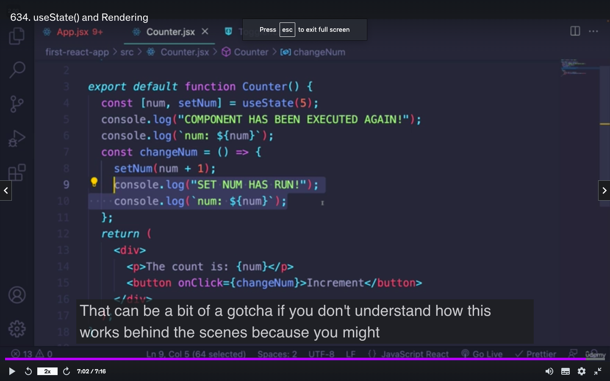
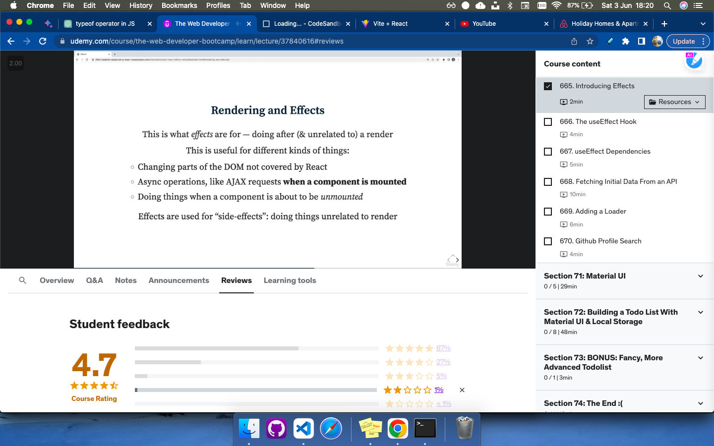

# REACT

- Front-End Library(helps make user interfaces)
[Official Documentation](https://react.dev/)

## Components
- small **reusable** components

Components are the building blocks of React applications. They are reusable bits of code that encapsulate behavior and presentation. Components can be used to create complex UIs with ease.

Here are some of the benefits of using components in React:

- Reusability: Components can be reused in multiple places in an application, which can save time and code duplication.
- Modularity: Components can be broken down into smaller, more manageable units, which makes code easier to understand and maintain.
- Testability: Components can be easily tested in isolation, which can help to ensure that they are working correctly.
- Performance: Components can be optimized for performance, which can improve the overall performance of an application.


- [Code Sandbox to run react](https://codesandbox.io/s/bold-worker-hq4mie)

3 already made files in code sandbox

- package json - > dependencies
- src -> where we make our components -> app js
- public -> html file 

### COMPONENTS are js logic + view content(i.e. html,css)

JSX
-  (JavaScript XML) is a syntax extension for JavaScript that allows you to write HTML-like code within JavaScript
- In JSX, you can use HTML-like tags to define elements and their attributes. You can also ```embed JavaScript expressions within curly braces {}``` to dynamically generate content or set attribute values. JSX elements can be assigned to variables, used within other JSX elements, or rendered to the DOM.

- Before you can use JSX, you need to transpile it into regular JavaScript using a tool like Babel. The transpiled code will convert JSX syntax into equivalent JavaScript code that creates and manipulates DOM elements.
FANCY JS(JSX) ----- BABEL-----> Legal JS

```
const element = (
  <div className="container">
    <h1>Hello, JSX!</h1>
    <p>This is a JSX example.</p>
    <button onClick={handleClick}>Click me</button>
  </div>
);
```
embeded js expression handleClick

## Basic React App Structure

1. App()    Funciton/Main Component
```
export default function App() {
  return (
    <div className="App">
      <h1>Hello CodeSandbox</h1>
      <h2>Start editing to see some magic happen!</h2>
    </div>
  );
}
```
- we can create children components of App() Component


2. file index.js is calling that App() and rendering(getElementById) inside the root element
```
const rootElement = document.getElementById("root");
const root = createRoot(rootElement);

root.render(
  <StrictMode>
    <App />
  </StrictMode>
);
```
3. then in the html file in public folder we have 
```
<div id="root"></div>
```
to display it


## Create Components
- function + return some jsx content(which will be rendered by babel)

```
function Welcome(props) {
  return <h1>Hello, {props.name}</h1>;
}
```

```
function Greeter()
{
  return <h1>Hello World</h1>
}
function Dog()
{
  return <p>woof</p>
}
export default function App() {
  return (
    <div className="App">
      <Greeter/>
      <Dog/>
    </div>
  );
}
```

Similarly we were calling App() from the index.js file
```
root.render(
  <StrictMode>
    <App />
  </StrictMode>
);
```


# JSX

- Each component shuld have its own file
- use es6 module to import code from diff files
- export from child function , import into where the function is needed

- 3 ways to export showed below 1 in greeter 1 in dog


in these 2 methods we can have a different name in the import file such as Dog -> Doggy but its NOT RECOMMENDED
```App.js```
```
import "./styles.css";
import Doggy from "./Dog"
import Greeter from "./Greeter"
export default function App() {
  return (
    <div className="App">
      <Greeter/>
      <Doggy/>
    </div>
  );
}

```

```Greeter.js```
```
export default function Greeter() {
  return <h1>Hello World</h1>;
}

```
```Dog.js```
```
function Dog() {
  return <p>woof</p>;
}

export default Dog;

```

## We can also export 1 or more functions using the following syntax
- here name should be exact

```
import "./styles.css";
import {Dog,add} from "./Dog"
import Greeter from "./Greeter"

add(2,3)
export default function App() {
  return (
    <div className="App">
      <Greeter/>
      <Doggy/>
    </div>
  );
}
```

```
function Dog() {
  return <p>woof</p>;
}

//need not neccessarily be a component
function add(x,y) {
    return x+y;
}
export  {Dog,add};
```


## Rules of JSX

1. Babel always looks for closing tags
- so if we are working with an for eg. input tag which does not have a closing tag - we put a / to act as closing tag

- this applies to all self closing elements eg, br, image

```
export default function LoginForm() {
  return <input type="password" />;
}
```


2. We can only return one top level element 
- eg. we wish to return input and some label and some text,
- to return more than one we need to enclose all into some div or p

### Does Not Work
```
export default function LoginForm() {
  return (
      <input type="password" />
      <input type="text" />
  );
}
```

### Works
```
export default function LoginForm() {
  return (
    <form>
      <input type="password" />
      <input type="text" />
      <button>LOGIN</button>
    </form>
  );
}
```

3. <> React fragments - empty wrapper element

- in the above eg. using a form made sense somewhere div , p would make sense but we dont want our app to be full of enclosing elements 
- in that case to satisfy jsx rule of returning only 1 top level element we can use <>

```
export default function LoginForm() {
  return (
    <>
      <input type="password" />
      <input type="text" />
      <button>LOGIN</button>
    </>
  );
}
```

## JSX Expressions
- Need
[AirBNB](https://www.airbnb.co.in/)
- As we can see in arbnb site we have multiple cards with sare format, image, city, price, dates , heart

- So we write it using expressions where basic TEMPLATE is same

- {JAVASCRIPT EXPRESSION} -> to treat it as dynamic
anything in {} is treated as js

egs.
```
function Dog() {
    const pet = "Elton";
  return <p> {pet} says woof</p>;
}
```

```
function Dog() {
  return <p> {2+3*4} says woof</p>;
}
```

## Creating a Die Roll Component

- Displays a random number 1-6
```
function Die() {
  return <p>Die says {Math.floor(Math.random() * 6) + 1}</p>;
}
export default Die;

```

## Components Hierarchy(Decomposition)

- to break into smaller pieces and have structural

- App.js
```
import "./styles.css";
import DieRoll from "./DieRoll";
export default function App() {
  return (
    <div className="App">
      <DieRoll />
      <DieRoll />
    </div>
  );
}
```
- DieRoll.js
```
import Die from "./Die";
export default function DieRoll() {
  return (
    <>
      <h1> Die Roll</h1>
      <Die />
      <Die />
      <Die />
    </>
  );
}
```
- Die.js
```
function Die() {
  return <p>Die says {Math.floor(Math.random() * 6) + 1}</p>;
}
export default Die;
```


## Styling Components

- for the top level element give a variable className(generally same as the component name)(cant use class here as in html bcz its a keyword in js)
- create a new .css file and give style to the .Die(class)
- import in Die() component file the css file
- We can also write the styles for all the components in the styles.css file but its not recommended to have all in one place

- Die.js
```
import "./Die.css";
function Die() {
  return <p className="Die">Die says {Math.floor(Math.random() * 6) + 1}</p>;
}
export default Die;
```
- Die.css
```
.Die {
  color: purple;
}
```

- DieRoll.js
```
import "./DieRoll.css";
import Die from "./Die";
export default function DieRoll() {
  return (
    <div className="DieRoll">
      <h1 className="header"> Die Roll</h1>
      <Die />
      <Die />
      <Die />
    </div>
  );
}
```
- DieRoll.css
- 2 methods to give inner elements
1. give className to inside elements
2. OR can use Nested Selecters like .className h1
```
.DieRoll {
  border: 2px dashed red;
  margin: 10px;
}

.header {
  border: 3px solid black;
}
.DieRoll h1 {
  color: blue;
}
```


- Pokemon example

```
import "./RandomPokemon.css";
export default function RandomPokemon() {
  const number = Math.floor(Math.random() * 151) + 1;
  // const url = `https://raw.githubusercontent.com/PokeAPI/sprites/master/sprites/pokemon/other/official-artwork/${number}.png`;
  return (
    <div className="RandomPokemon">
      <h1>Pokemon #{number}</h1>
      
      {/*  */}
    </div>
  );
}
```
```
.RandomPokemon {
  width: 250px;
  height: 300px;
  text-align: center;
  color: blue;
  border: 1px solid black;
}
.img {
  width: 250px;
  height: 200px;
}
```
```
import "./styles.css";
import RandomPokemon from "./RandomPokemon";
export default function App() {
  return <RandomPokemon />;
}
```

# Setting up VITE for running React on local machine on VS CODE

```
ON TERMINAL

1. npm create vite@latest
2. cd first-react-app
  npm install
  npm run dev
```

```
/Users/raunakkumar/first-react-app
```


## Props in React

- Its Basically Function Arguments
- In React, "props" (short for properties) are a way to pass data from a parent component to its child components. Props are used to make components reusable and configurable, allowing you to customize their behavior and appearance.
- values are passed like attributes

1. String Props (passing 1 or more parameters)
App.js
```
import "./styles.css";
import Greet from "./Greet.js";
export default function App() {
  return (
    <div>
      <Greet person="Bill" from="Elton"/>
      <Greet person="Jack" from="Tom"/>
      <Greet person="Jone" from="Bane"/>
    </div>
  );
}
```
- while passing if we use " " it will passed as string


Greet.js
```
export default function Greet(props) {
  return (
    <p>
      Hi there {props.person} from {props.from}!!!
    </p>
  );
}
```


- We can also deconstruct the parameter before hand
```
export default function Greet({ person,from }) {
  return <p>Hi there {person} from {from}!!!</p>;
}
```


2. Non String Props
- using { } we can pass non string parameters
App.js
```
import "./styles.css";
import Die from "./Die.js";
export default function App() {
  return (
    <div>
      <Die number={12} />
      <Die number={20} />
    </div>
  );
}

```

Die.js
```
export default function Die({ number }) {
  let op = Math.floor(Math.random() * number) + 1;
  return (
    <div>
      {number} sided Die Says {op}
    </div>
  );
}
```


## Default params

App.js
```
import "./styles.css";
import Greet from "./Greet.js";
export default function App() {
  return (
    <div>
      <Greet from="Elton"/>
      <Greet person="Jack" />
      <Greet person="Jone" from="Bane"/>
    </div>
  );
}
```

```
export default function Greet({ person = "Everyone",from="Anonymous" }) {
  return <p>Hi there {person} from {from}!!!</p>;
}
```

## passing variables/objects/arrays

- using { } we can pass them

- Arrays - values = {[]}
- Objects - values = {{}}

```
import React from 'react';
import Greet from './greet';

export default function App() {
  const names = ['Alice', 'Bob', 'Charlie'];

  return (
    <div>
      <h1>Greetings</h1>
      <Greet names={names} />
    </div>
  );
}
```

- for arrays - ```<Greet names={['Alice', 'Bob', 'Charlie']} />```
- for objects - ```<Greet names={{a:1,b:2}} />```

```
import React from 'react';

export default function Greet(props) {
  const { names } = props;

  return (
    <div>
      <h2>People to Greet:</h2>
      <ul>
        {names.map((name, index) => (
          <li key={index}>{name}</li>
        ))}
      </ul>
    </div>
  );
}
```


## React Conditionals

- Dice game

```
import React from 'react';
import Game from './game';

export default function App() {
  return (
    <div>
      <h1>Dice Game</h1>
      <Game />
    </div>
  );
}
```

```
import React from 'react';

export default function Game() {
  // Generate random numbers between 1 and 6 for two dice rolls
  const dice1 = Math.floor(Math.random() * 6) + 1;
  const dice2 = Math.floor(Math.random() * 6) + 1;

  // Check if both dice have the same value
  const result = dice1 === dice2 ? 'You Win' : 'Try Again';

  return (
    <div>
      <p>Dice 1: {dice1}</p>
      <p>Dice 2: {dice2}</p>
      <p>{result}</p>
    </div>
  );
}
```

- We can also directly write the conditional inside the {}
```
<p>{dice1 === dice2 ? 'You Win' : 'Try Again'}</p>
```

- if we only want the result to be displayed if we win we try a different approach bcz we dont want empty h2 
```
{dice1 === dice2 ? <p>'You Win'</p> : null}
```

- so we only put h2 inside the codnitonal if we have favourable output

- 1 more method 
```
{dice1 === dice2 && <p>'You Win'</p> }
```


# React Developer Tools (Chrome Extension)
(works on websites built using react)
- Added to personal email 
- to use Right click-> inspect -> >> tabs -> Components tab


## Adding Dynamic Style inside the .js file
- if style is not uniform accross all and maybe governed by conditions we can put it inside the .js

```
export default function Die() {
  let num1 = Math.floor(Math.random() * 3) + 1;
  let num2 = Math.floor(Math.random() * 3) + 1;
  const styles = { color: num1 === num2 ? "green" : "red" };
  return (
    <div style={styles}>
      <h1>Die game</h1>
      <p> Die 1 {num1}</p>
      <p> Die 2 {num2}</p>
    </div>
  );
}
```

- Or we can directly write as an attribute
```
export default function Die() {
  let num1 = Math.floor(Math.random() * 3) + 1;
  let num2 = Math.floor(Math.random() * 3) + 1;
  return (
    <div style={{ color: num1 === num2 ? "green" : "red" }}>
      <h1>Die game</h1>
      <p> Die 1 {num1}</p>
      <p> Die 2 {num2}</p>
    </div>
  );
}
```

### - We can add these styles to any tag here div,h1,p

- We can also pass colors/styles using params

```
import "./styles.css";
import Die from "./Die.js";
export default function App() {
  return (
    <div>
      <Die color="green" />
      <Die s/>
    </div>
  );
}
```

```
export default function Die({ color = "blue" }) {
  let num1 = Math.floor(Math.random() * 3) + 1;
  let num2 = Math.floor(Math.random() * 3) + 1;
  const styles = { color: num1 === num2 ? color : "red" };
  return (
    <div style={styles}>
      <h1>Die game</h1>
      <p> Die 1 {num1}</p>
      <p> Die 2 {num2}</p>
    </div>
  );
}
```
# in Js css properties are in camel case
- eg. font-size is fontSize in js like class is className


## Rendering Arrays with map

**revise**

```
import React from 'react';

export default function ColorList() {
  const colors = ['red', 'blue', 'green', 'yellow'];

  return (
    <div>
      <h1>Color List</h1>
      <ul>
        {colors.map((color, index) => (
          <li key={index} style={{ backgroundColor: color }}>
            {color}
          </li>
        ))}
      </ul>
    </div>
  );
}
```


## Slot Game

```
export default function slot({ one, two, three }) {
  let res = one === two && one === three;
  return (
    <div>
      <h1>
        hi
        {one} {two} {three}
      </h1>
      <h2 style={{ color: res ? "green" : "red" }}>
        {res ? "You Win" : "You lose"}
      </h2>
      {res ? <h3>"Congrats"</h3> : null}
    </div>
  );
}
```
```
export default function slot({ one, two, three }) {
  let res = one === two && one === three;
  return (
    <div>
      <h1>
        
        {one} {two} {three}
      </h1>
      <h2 style={{ color: res ? "green" : "red" }}>
        {res ? "You Win" : "You lose"}
      </h2>
      {res ? <h3>"Congrats"</h3> : null}
    </div>
  );
}
```


## Shopping List

- make sure to convert boolean to string
- imp MAP function usage


```
import Shopping from "./Shopping";
import "./styles.css";
//array of object
const data = [
  { item: "Eggs", Quantity: 12, completed: false },
  { item: "Bread", Quantity: 15, completed: true },
  { item: "Butter", Quantity: 2, completed: true },
  { item: "Vege", Quantity: 6, completed: false }
];
export default function App() {
  return (
    <div>
      <Shopping items={data} />
      {/* items should be the same name as in the component file */}
    </div>
  );
}
```

```
export default function Shopping({ items }) {
  return (
    <div>
      <h1>Shopping List</h1>
      <ul>
        {items.map((i) => (
          <li
            style={{
              color: i.completed === true ? "green" : "black",
              textDecoration: i.completed === true ? "line-through" : "none"
            }}
          >
            {i.item} - {i.Quantity} - {i.completed.toString()}
          </li>
        ))}
      </ul>
    </div>
  );
}
```


## Key prop

# React Events
- interactions(like Dom in vanilla JS)

- use onClick
- dont use () with the function name
## All DOM events i.e. in Vanilla JS are also inside React, Except they are CAMELCASED.
App.js
```
import "./styles.css";
import Clicker from "./Clicker.js"
export default function App() {
  return (
    <div>
      <Clicker />
    </div>
  );
}
```

Clicker.js
```
function handleClick() {
  console.log("Button Clicked");
}
export default function Clicker() {
  return (
    <div>
      <p>Click on me</p>
      <button onClick={handleClick}>Click</button>
    </div>
  );
}
```
- pass only the name of the function

[Events list](https://developer.mozilla.org/en-US/docs/Web/Events)

- some egs. 
1. dblclick
2. onMouseOver
3. keyDown
etc. 


- On submitting(eg. in a form) in js the page refreshes instantly -> this is natural behaviour
- if we want to prevent refresh we need to capture the onSubmit in an object and prevent default behaviour


Form.js
```
function handleFormSubmit(evt) {
   evt.preventDefault();
  console.log("clicked");
}
export default function Form() {
  return (
    <div>
      <form onClick={handleFormSubmit}>
        <button>Submit</button>
      </form>
    </div>
  );
}

```

```
if we dont write
   evt.preventDefault();
page is refreshed instantly
 ```

- Practice - on clicking button show a message using the Clicker function above

App.js
```
import "./styles.css";
import Clicker from "./Clicker.js";
export default function App() {
  return (
    <div>
      <Clicker buttonText="Click on me" message="keep clicking" />
      <Clicker buttonText="DOnt Click on me" message="stop clicking" />
    </div>
  );
}

```

- 2 methods
1. writing inline onClick using arrow function 

Clicker.js
```
export default function Clicker({ buttonText, message }) {
  return (
    <div>
      <p>Click on me</p>
      <button onClick={() => alert(message)}>{buttonText}</button>
    </div>
  );
}
```

2. write a separte arrow function but **inside** the first function itself

Clicker.js
```
export default function Clicker({ buttonText, message }) {
  const handleClick = () => {
    alert(message);
  };
  return (
    <div>
      <p>Click on me</p>
      <button onClick={handleClick}>{buttonText}</button>
    </div>
  );
}
```

# State in React

```
export default function Counter() 
{
  let counter = 0;

  const incrementCounter = () => {
    counter++;
    console.log("Counter Value:", counter);
  };

  return (
    <div>
      <h1>Counter</h1>
      <p>Counter Value: {counter}</p>
      <button onClick={incrementCounter}>Increment</button>
    </div>
  );
};

```
- using event handler increment value of counter every time button is clicked. Show that the value of counter displayed is unchanged but the value is changing behind the scene in console.log

- react should rerender its new value but its not, to tackle this we use concept of STATE

## props -> data passed to a component -> IMMUTABLE
## State -> data specific to an instance of a component -> CAN CHANGE

### therefore whenever a state is changed the page is re rendered


# Conclusion - if you want to have a component in which value changes and you want it to be re rendered-> use STATE

## Using State in a Component

## Use State Hook

```
const [counter, setCounter] = useState(0);
```
returns an array consisiting of 2 things- 
1. piece of state itself -> counter
2. A function to change the piece of state -> setCounter
3. (initialvalue)
## useState must be called **inside** the component & function also written inside component(may use => function)
## need to import  
- we destructure the returnin array
 


```
import { useState } from "react";

export default function Counter()
{
  const [counter, setCounter] = useState(0);


  const incrementCounter = () => {
    setCounter(counter + 1);
    console.log("Counter Value:", counter + 1);
  };

  return (
    <div>
      <h1>Counter</h1>
      <p>Counter Value: {counter}</p>
      <button onClick={incrementCounter}>Increment</button>
    </div>
  );
};

```
- now we get new render


## Creating a Toggler Component

- on cicking happy face <-> sad face

App.js
```
import "./styles.css";
import Toggler from "./Toggler";
export default function App() {
  return (
    <div>
      <Toggler />
    </div>
  );
}

```

- Toggler.js
```
import { useState } from "react";

export default function Toggler() {
  const [isHappy, setIsHappy] = useState(true);
  const toggleIsHappy = () => {
    setIsHappy(!isHappy);
  };

  return (
    <div>
      <h1>Toggle</h1>
      <p onClick={toggleIsHappy}>{isHappy ? ":)" : ":("}</p>
    </div>
  );
}
```


## Multiple Pieces of State within a given component

- we can use useState hook as many times in a component

- when click on emoji, toggle it
- when click on button increment

```
import { useState } from "react";

export default function ToggleCounter() {
  const [isHappy, setIsHappy] = useState(true);
  const [count, incCount] = useState(0);
  const toggleIsHappy = () => {
    setIsHappy(!isHappy);
  };
  const Counter = () => incCount(count+2);

  return (
    <div>
      <h1>Toggle</h1>
      <p onClick={toggleIsHappy}>{isHappy ? ":)" : ":("}</p>
      <p>{count}</p>
      <button onClick={Counter}>+</button>
    </div>
  );
}
```


## life cycle of component and how they are rendered

- when useState func updates any value --> entire function runs again

- before rendering the component the value is same as old value, it is updated only when its rendered so try to write any logic accordingly




# Box Color Project (complete)


## BEST METHOD TO UPDATE A STATE(when updating using a previous state)
- problem
```
import { useState } from "react";
export default function Counter() {
  console.log("RENDERED!!!");
  const [count, setCount] = useState(0);
  const addOne = () => {
    setCount(count + 1);
  };
  const setToTen = () => {
    setCount(10);
  };
  const addThree = () => {
    setCount((currentCount) => currentCount + 1);
    console.log(count);
    setCount((currentCount) => currentCount + 1);
    setCount((currentCount) => currentCount + 1);
  };
  return (
    <div>
      <p>Count: {count}</p>
      <button onClick={addOne}>+1</button>
      <button onClick={addThree}>+3</button>
      <button onClick={setToTen}>Set To 10</button>
    </div>
  );
}
```


```
  const addOne = () => {
    setCount(count + 1);
  };
```
- this works fine 
```
  const addThree = () => {
    setCount(count + 3);
  };
```
- and so does this

```
  const addThree = () => {
    setCount(count + 1);
    setCount(count + 1);
    setCount(count + 1);
  };
```
- but the above snippet only adds 1 to the previous count
- REASON -> because each setCount gets the original count as the component is not rendered

- TO SOLVE THIS We should use arrow function to update any state when it uses the previous state , whenever a state is updated to a new state with the help of previous state we should follow this 

```
const addThree = () => {
    setCount((currentCount) => currentCount + 1);
    console.log(count); //value of count does not update though
    setCount((currentCount) => currentCount + 1);
    setCount((currentCount) => currentCount + 1);
  };

```

- this method does not cause Rerendering at each step, hence value of count remains as the previous one only
- what it does is uses the updated temporary value for the next updates

- All updates are batched together and will be rendered at once


- no need to use this method if simply initialising a value
```
setColor("red");
```


# useEffect Hook in React
- Section 70


- The useEffect hook in React is used to perform side effects in functional components. It allows you to run code in response to certain dependencies or when the component mounts or unmounts.


```
import { useState, useEffect } from "react";
export default function Counter() {
  console.log("RENDERED!!!");
  const [count, setCount] = useState(0);
  useEffect(function myEffect() {
    console.log("My effect was called");
  }); 
  //inline function
  const addOne = () => {
    setCount(count + 1);
  };
  return (
    <div>
      <p>Count: {count}</p>
      <button onClick={addOne}>+1</button>
    </div>
  );
}
```
- by default myEffect() runs after all rerenders
```
useEffect(effectFunction, [productID,userID])
```
- second parameter is dependencies, it runs effectFunction only if productId ot userID vars are changed


# React hooks
- done from [Youtube Playlist](https://www.youtube.com/playlist?list=PLC3y8-rFHvwisvxhZ135pogtX7_Oe3Q3A)


- React Hooks are a feature introduced in React version 16.8 that allows you to use state and other React features without writing a class. 

- eg. state of a component

- hooks dont work inside classes

## Why hooks

1. Prior to hooks, state management in React components was primarily handled through class components, using the this.state and this.setState methods.
2. Classes dont minify very well and make hot reloading very unreliable
3. Complex component hierarchies: With class components, when you needed to share stateful logic between multiple components, you had to use techniques like higher-order components or render props. This often led to nested and complex component hierarchies, making the code harder to understand and maintain. Hooks allow you to encapsulate and reuse stateful logic within a single functional component, reducing the need for deeply nested components.

4. with hoks related code is organised into one place


- we can use classes or hooks or both , both are supported

