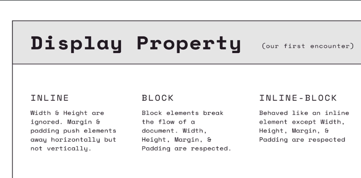

CSS (Cascading Style Sheets) is a stylesheet language used to describe the visual appearance and formatting of HTML documents. It is used to control the layout, colors, fonts, and other visual aspects of a web page.

- CSS selectors are used to target specific HTML elements for styling. Selectors can be based on element types, classes, IDs, attributes, and more. 
- CSS rules are defined by combining selectors with declarations enclosed in curly braces ({ }), where each declaration consists of a property and a value.


```
selector {
    property : value;
}


```

```
/* CSS rule to target all paragraphs */
p {
  color: blue;
  font-size: 16px;
}

/* CSS rule to target elements with class "my-class" */
.my-class {
  background-color: yellow;
}

/* CSS rule to target an element with ID "my-element" */
#my-element {
  border: 1px solid black;
}
```

- READ ---- 
To select every other text input and give it a right border using CSS, you can use the nth-child selector along with the even keyword. 

```
input[type="text"]:nth-child(even) {
  border-right: 2px solid red;
}
```


## [CSS Properties](https://developer.mozilla.org/en-US/docs/Web/CSS/Reference)

## use google to apply css


- We can also add style in the html file itself but its not recommended

//M1 -> Inline Element with html tags ```<button style="color: blue; background-color:red">```


//M2 -> Internal css ```<style>  </style> inside the <head>```


## M3 Best Method to write an external sheet
- Need to link in the ```<head>``` of html file

```
<head>
  <link rel="stylesheet" href="styles.css">
</head>
```

----------
# CSS PROPERTIES
## <mark>Alwyas apply ; after every property</mark> 

1. color(TEXT)
- The color property in CSS is used to set the color of text content. It allows you to specify the color using various formats such as named colors, hexadecimal values, RGB values, HSL values, and more.

[Named Colors List](https://developer.mozilla.org/en-US/docs/Web/CSS/named-color)

# [Color Picker](https://htmlcolorcodes.com/color-picker/)

```
//by color name
p {
  color: red;
}


//hexadecimal
h1 {
  color: #336699;
}
_ _    _ _    _ _
red  yellow  green
0-ff-> 0-255

//hexadecimal
h1 {
  color: #0fa;
}

//if two values of r ,g, b are same we can covert it to a 3 digit code


//by rgb values
span {
  color: rgb(255, 0, 0);
}


a {
  color: hsl(240, 100%, 50%);
}


```


2. background-color

- The background-color property in CSS is used to set the background color of an element. It allows you to specify the color using various formats such as named colors, hexadecimal values, RGB values, HSL values, and more.

```
body {
  background-color: lightblue;
}
```

##  as header is block level it will color the entire block

# Text Properties

3. text-align

justify, right, centre, left
```
h1{
    text-align:justify;
}
```

4. font-weight

Here are some commonly used values for the font-weight property:

1. normal: This is the default value, which represents the normal font weight.
2. bold: This value makes the text appear bold or thicker than normal.
3. bolder: This value makes the text even bolder than the parent element's font weight.
4. lighter: This value makes the text lighter than the parent element's font weight.
- Numeric values: You can also specify numeric values ranging from <mark>100 to 900</mark> , with 100 being the lightest and 900 being the boldest. Not all numeric values are supported by all fonts.

```
h1{
    font-weight:bolder;
}

h2{
    font-weight:300;
}
```

5. text-decoration


Here are some commonly used values for the text-decoration property:

1. none: This is the default value, which removes any text decoration.
2. underline: This value adds an underline to the text.
3. overline: This value adds a line above the text.
4. line-through: This value adds a line through the middle of the text, indicating that it is crossed out.
5. underline overline: This value adds both an underline and an overline to the text.
6. ```inherit```: This value inherits the text decoration from the parent element.


- We can also give colors to lines(hex or name)
- we can also define the types of the lines 

- can be written in any order

```
.over {
  text-decoration: lime overline wavy;
}


.plain {
  text-decoration: none;
}


.thick {
  text-decoration: solid underline purple 4px;
}

```


7. ```line-height```
- The line-height property in CSS is used to control the height of a line of text. It specifies the vertical space between lines of text within an element.

The line-height property accepts various types of values, including:

- Numeric values: These values define a multiple of the font size. For example, 1.5 will set the line height to 1.5 times the font size.
- Length values: These values define an absolute line height in pixels, ems, or other length units.
- Percentage values: These values define a percentage of the font size. For example, 150% will set the line height to 150% of the font size.

```
p {
  line-height: 1.5; 
  //this means 1.5 times the font size
}

h1 {
  line-height: 2em;
}

span {
  line-height: 120%;
}

```

8. ```letter-spacing```

- The letter-spacing property in CSS is used to control the spacing between characters in a text element. It specifies the amount of additional space to be added or removed between adjacent characters.
```
p {
  letter-spacing: 2px;
}

h1 {
  letter-spacing: -1px;
}

span {
  letter-spacing: 0.5em;
}
```

9. ```font-size```

- Relative units 
1. EM
2. REM
3. VH
4. VW
5. %

- Absolute units
1. PX
2. PT
3. CM
4. IN
5. MM


```
h1 {
  font-size: 100%;
}
h2 {
  font-size: 1.6px;
}
```


10. ```font-family```

- There can be many custom made fonts
- but now we should use only which are mostly compatible with most browsers

[Fonts Compatibility](https://www.cssfontstack.com/)


```
.cursive {
  font-family: cursive;
}

.fantasy {
  font-family: fantasy;
}

.emoji {
  font-family: emoji;
}
```

- We can give as many backup fonts as we want if earlier are not available
```
.sansserif {
  font-family: Verdana, Arial, Helvetica;
}
```

- Or we give a backup family name so that browser can pick any it has avialable
```
/* A font family name and a generic family name */
.sansserif {
  font-family: Verdana, Arial, Helvetica, sans-serif; //last is family name
}
```
- Or we can basically directly give font - family for browser to pick


# Selectors in CSS

- used to select different items in html
- Basic css rule


```
selector {
    property : value;
}
```

1. ```Universal Selector```
- The universal selector, denoted by the asterisk (*), is a CSS selector that matches any element in an HTML document. It selects all elements regardless of their type, class, or ID.

```
* {
  margin: 0;
  padding: 0;
  box-sizing: border-box;
}
```


2. ```Element Selector```
- The element selector in CSS is used to target and apply styles to specific HTML elements based on their tag name. It selects all instances of a particular HTML element on the page.

```
h1 {
  color: blue;
  font-size: 24px;
}


//or 
button
{
    font-size: 20px;
}
```

2. (a) ```Selector List```

- In CSS, a selector list allows you to apply styles to **multiple elements by combining multiple selectors together.** Each selector in the list is separated by a comma.

```
h1, h2, h3 {
  color: red;
  font-size: 20px;
}
```
```
.container .box, .container .button {
  background-color: blue;
  border: 1px solid black;
}
```

3. ```ID Selector```

- In CSS, an **ID selector** is used to select and **style a specific HTML** element based on its unique ID attribute value. The ID selector is denoted by the ```#``` symbol followed by the ID value.


- In the above example, the ID selector **#myElement** targets an HTML element with the ID attribute set to "myElement". The specified styles will be applied only to that specific element.

**IDs should be ```unique``` within an HTML document, meaning each ID** should only be assigned to a single element. This uniqueness allows the ID selector to reliably target and style a specific element.

To use the ID selector, you'll need to assign the desired ID value to the corresponding HTML element using the **id attribute.** 

### HTML CODE:
```
<div id="myElement">This is a div with the ID "myElement".</div>
```

### CSS
```
#myElement {
  color: blue;
  font-size: 18px;
}
```

```
<!DOCTYPE html>
<html lang="en">

<head>
  <meta charset="UTF-8">
  <meta http-equiv="X-UA-Compatible" content="IE=edge">
  <meta name="viewport" content="width=device-width, initial-scale=1.0">
  <title>Login Page</title>
  <style>
    #loginButton {
      background-color: blue;
      color: white;
    }
  </style>
</head>

<body>
  <h1>Login Page</h1>

  <form>
    <label for="username">Username:</label>
    <input type="text" id="username">
    <br>
    <label for="password">Password:</label>
    <input type="password" id="password">
    <br>
    <button type="submit">Login</button>
    <button id="loginButton" type="button">Register</button>
  </form>
</body>

</html>
```

[Color Pallette](https://coolors.co/)


4. ```class selector```

- basically extension of id selector, only diff is that only 1 object can have 1 unique id

- to style multiple elements similarly we can give those we want to style same class then style them

- **they need not be all of same types, like all divs or all spans, they can be of diff types**


```
<!DOCTYPE html>
<html lang="en">

<head>
  <meta charset="UTF-8">
  <meta http-equiv="X-UA-Compatible" content="IE=edge">
  <meta name="viewport" content="width=device-width, initial-scale=1.0">
  <title>Class Selector Example</title>
  <style>
    .highlight {
      background-color: yellow;
    }
  </style>
</head>

<body>
  <h1>Class Selector Example</h1>

  <p class="highlight">This paragraph has the highlight class.</p>
  <p>This paragraph does not have the highlight class.</p>
  <p class="highlight">Another paragraph with the highlight class.</p>
</body>

</html>
```


5. ```Descendant Selector```

- The descendant selector in CSS allows you to select elements that are descendants of another element. It is represented by a ```space``` ' ' between two or more selectors.

can have multiple descendenants
eg

```
.tag span a{

}

// means all a's inside all span which are of the class tag
```

```
<!DOCTYPE html>
<html lang="en">

<head>
  <meta charset="UTF-8">
  <meta http-equiv="X-UA-Compatible" content="IE=edge">
  <meta name="viewport" content="width=device-width, initial-scale=1.0">
  <title>Descendant Selector Example</title>
  <style>
    .container p {
      color: blue;
    }
  </style>
</head>

<body>
  <div class="container">
    <h1>Title</h1>
    <p>This paragraph has blue text color.</p>
    <div>
      <p>This paragraph is also a descendant of the container class.</p>
    </div>
  </div>
  
  <p>This paragraph is not a descendant of the container class.</p>
</body>

</html>
```


eg2
html
```
<!--DON'T CHANGE THIS FILE (PLEASE!)-->
<header>
  <a href="/home">Home</a>
  <a href="/contact">Contact</a>
  <a href="/about">About</a>
</header>

<p>
  I like to eat <a href="/popcorn">popcorn</a> and <a href="/donuts">donuts</a>
</p>

<p id="dislikes">
  I hate eating <a href="/pickles">pickles</a> and <a href="/beets">beets</a>
</p>
```
css
```
header a{
    font-size: 30px;
    color: teal;
}
#dislikes a {
    font-weight: bold;
    color: red;
}
```


6. ```Adjacent Selector```

- The adjacent sibling selector in CSS allows you to select an element that immediately follows another specific element. It is represented by a plus sign ```(+)``` between two selectors.


```
h2 + p {
color: red;
}
```
```
<!DOCTYPE html>
<html lang="en">

<head>
  <meta charset="UTF-8">
  <meta http-equiv="X-UA-Compatible" content="IE=edge">
  <meta name="viewport" content="width=device-width, initial-scale=1.0">
  <title>Adjacent Sibling Selector Example</title>
  <style>
    h2 + p {
      color: red;
    }
  </style>
</head>

<body>
  <h2>Title</h2>
  <p>This paragraph will have red text color.</p>
  <div>
    <h2>Another Title</h2>
    <p>This paragraph will be affected by the CSS rule.</p>
  </div>
  <p>This paragraph will not be affected by the CSS rule either.</p>
</body>

</html>
```

7. ```Direct Child Selector```

- The direct child selector in CSS allows you to select elements that are direct children of a specific parent element. It is represented by a greater than sign ```(>) ```between the parent selector and the child selector.

```
div > p {
color: blue;
}
```


```
<!DOCTYPE html>
<html lang="en">

<head>
  <meta charset="UTF-8">
  <meta http-equiv="X-UA-Compatible" content="IE=edge">
  <meta name="viewport" content="width=device-width, initial-scale=1.0">
  <title>Direct Child Selector Example</title>
  <style>
    div > p {
      color: blue;
    }
  </style>
</head>

<body>
  <div>
    <p>This paragraph will have blue text color.</p>
    <span>This span will not be affected by the CSS rule.</span>
    <p>This paragraph will also have blue text color.</p>
  </div>
  <p>This paragraph is not a direct child of the div, so it will not be affected by the CSS rule.</p>
</body>

</html>
```


8. ```Atrribute Selector```

- The attribute selector in CSS allows you to select elements based on their attribute values. It provides a way to target elements that have specific attribute values or attributes that match a certain pattern.

- Even class , id , types are attribute,
- therefore any thing written within the first tag is an attribute

[MDN website to check all Possibilities](https://developer.mozilla.org/en-US/docs/Web/CSS/Attribute_selectors)

1. ```Attribute presence selector```
```
input[type="text"] {
  /* Styles applied to text input elements */
}

OR
input[type="password"] {
  /* Styles applied to text input elements */
}
```

2. ```Attribute value selector```
```
a[href="https://example.com"] {
  /* Styles applied to anchor elements with href set to "https://example.com" */
}
```


3. ```Substring attribute selector```

```
img[src*="logo"] {
  /* Styles applied to image elements with src containing "logo" */
}
OR
$ -> Ends With attribute

img[href$="logo"] {
  /* Styles applied to image elements with src containing "logo" */
}

```


# The BOX MODEL in CSS

- in css everything is considered to be contained in a box


- width and height is that of the content area 


- border of box


- Important Border Properties

[MDN BORDER](https://developer.mozilla.org/en-US/docs/Web/CSS/border)

1. ```border-width```
- after adding a border of 5px box gets 
bigger by 10px
- if we want entire width of box to be equal to the width given use
``` 
box-sizing:border-box;
```
- now content is width-10
- By default its content-box
2. ```border-color```
3. ```border-style``` - we can have multiple options for each side


## We have each of the three properties as

- ```border-left-width```
- ```border-left-color```
- ```border-left-style```

- Similarly -> top, right, bottom

### Border ```shorthand``` property 
- to give all three in one go
order
```
border: [border-width] [border-style] [border-color];
```

4. ```border-radius``` - curving of corners
in terms of px or percentage% ( of width and heigh)

### To make a circle box use border-radius = ```50%```

- **we can also do specifically for each of 4 borders**

- We can also create many creative shapes using it 

```
<!--YOU DON'T NEED TO TOUCH THE MARKUP!-->
<div class="card">
  
  <h1>I Am Dog</h1>
</div>
```
```
/* YOUR CODE GOES IN HERE */
div{
    width: 210px;
    border: 1px solid grey;
    border-radius: 5px;
    text-align: center;
}
img{
    width: 200px;
    border: 5px solid rgb(236,183,191);
    border-radius: 50%;
}
```

## padding


0. ```4 values``` TRBL(clockwise from top)
```
padding: [top] [right] [bottom] [left];
```

1. ```1 value:```  All 4 sides
```
padding: 10px;
```

2. ``2 values``: irst value will be applied to the ```top and bottom```, and the second value will be applied to the ```right and left.```

3. ```3 values```: the first value will be applied to the ```top```, the second value will be applied to the ```right and left```, and the third value will be applied to the ```bottom```.


## Margin


```
.example {
  margin: 10px; /* Sets a margin of 10 pixels for all sides */
}
```

```
.example {
  margin-top: 10px;
  margin-right: 20px;
  margin-bottom: 10px;
  margin-left: 20px;
}
```
## ShortHands 

```
.example {
  margin: 10px 20px; /* Sets 10px top and bottom margins, and 20px right and left margins */
}
```

```
.example {
  margin: 10px 20px 15px 25px; /* Sets 10px top margin, 20px right margin, 15px bottom margin, and 25px left margin */
}
```


- In dev tools 
1. blue -> content box
2. green -> padding
3. orange -> margin

- h1 by default has some margin


- ```body by default has some margin```
--------------------
# Display Properties



1. Block
2. Inline
3. Inline-Block

## To hide an element

```display:none;```

---------
```
h2 {
    background-color: palegoldenrod;
    border: 2px solid green;
    display: inline;
    /* Now it behaves like an inline element */
    width: 300px;
    /* width and height commands are ignored for inline elements */
    margin: 50px;
    /* Margin is respected ONLY HORIZONTALLY for inline elemnets */
    padding: 20px;
    /* But padding is respected for inline elements */
    /* But this padding is actually not pushing away anything rather its overlapping */

}

span {
    background-color: palegreen;
    border: 2px solid green;
    display: block;

    /* Now it behaves like an block element */
    width: 60px;
    height: 40px;
    margin: 60px;
    padding: 100px;
    /* For block level elements all width height padding and margin are respected */
}

div {
    display: inline-block;
    /* It is now an inline block */
    width: 250px;
    height: 150px;
    background-color: violet;
    border: 3px dotted blue;
    margin: 30px;
    padding: 50px;

    /* Everything is respected */


}
```
--------------

# CSS UNITS


- % Someimes w.r.t parent sometimes w.r.t element itself
- important to notice --> line-height  (element itself)


- First para defines the font- size

- other properties like padding and margins
- it depends on the font size of the same element

### em w.r.t to properties help keeps things relative
for eg. if we change the size of the button then if border-radius is in ems it will also scale relatively if its in em not px


-------------
# Section 9 Other CSS Properties

- Alpha Channel: The alpha channel refers to the fourth component of the RGBA color model, which represents the ```transparency``` of a color. In CSS, you can use the rgba() color notation to specify a color with an alpha channel. The alpha value is a decimal number between 0 and 1, where 0 is fully transparent and 1 is fully opaque. For example:

```
.element {
  background-color: rgba(255, 0, 0, 0.5); /* Red color with 50% transparency */
}
```
 We can also give transparency using hexa codes but its not very user friendly

- To give transparency using hexadecimal notation, you can utilize the alpha channel by adding two additional digits at the end of the hexadecimal color code. These two digits represent the opacity level, ranging from 00 (fully transparent) to FF (fully opaque).
- The alpha channel controls the transparency level, with 00 being fully transparent and FF being fully opaque.

eg. ```if your original color code is #FF0000 (red), the transparent version with 50% opacity would be #FF000080.```

--------------
- Opacity: The opacity property allows you to specify the ***overall transparency of an element***. It accepts a value between 0 and 1, where 0 represents completely transparent (invisible) and 1 represents fully opaque (completely visible). Intermediate values between 0 and 1 create varying levels of transparency. For example:

```
.element {
  opacity: 0.5; /* 50% transparency */
}
```


## Position Property

[IMPORTANT: View MDN](https://developer.mozilla.org/en-US/docs/Web/CSS/position)

1. static
2. relative
3. absolute(read)
4. sticky(read)


## Transition Property


# FlexBox

- Flexible
- Distributing Space in a Container
- not harcoding the dimensions, so that when we resize the window everything readjusts/rearrange(row to column or wise versa) proportionally

## Properties of FlexBox

( working in the FlexBox folder ) 

- To turn on 
```
display: flex;
```
- by defualt Main axis is horizontal LtoR
i.e ```row```

- to change

```
flex-direction: row;  //default
flex-direction: row-reverse;  //RtoL
flex-direction: column;  //TtoB
flex-direction: column-reverse;   //BtoT
```
- for imgaes of these look udemy course L104

- even though we have given sizes to the inner components but they automatically resize and fit to the outer container(flexible)

- ```justify-content```
- flex-start means start w.r.t to the main axis. eg. if it is row-reverse --> start means flows from right

```
justify-content: flex-start;  //bydefault
justify-content: flex-end;   //Aligns flex items to the end of the container.
justify-content: center;   //Centers flex items along the main axis.
justify-content: space-between;  // Distributes flex items evenly along the main axis, with the first item aligned to the start and the last item aligned to the end.
justify-content: space-around;//Distributes flex items evenly along the main axis, with equal space before the first item and after the last item, and equal spacing between each pair of adjacent items.

justify-content: space-evenly;  //Distributes flex items evenly along the main axis, with equal space before the first item, after the last item, and between each pair of adjacent items.
```


- ```flex-wrap```

- it basically dictates direction of cross axis 

- if we set this to wrap -> components don't shrink instead they move to new starting row/column
- and how each parallel axis is aligned depends on justify-content

- The flex-wrap property in CSS is used to control how flex items are wrapped or displayed when they exceed the width of the flex container along the main axis. 

```
flex-wrap: nowrap;  //default All flex items are forced to stay within a single line.

flex-wrap: wrap;  //Flex items wrap onto multiple lines if needed.

flex-wrap: wrap-reverse; //Flex items wrap onto multiple lines in reverse order. i.e . if its main axis is row first line will come horizontally then second below it
if its set to reverse, first line comes to bottom and its in reverse order of cross axis
```


- ```align-items```


- justify-content was main axis.
- The align-items property in CSS is used to control the alignment of flex items along the ```cross axis``` within a flex container.


```
align-items: stretch;  //Default value. Flex items are stretched to fill the container along the cross axis.

align-items: flex-start;    //Flex items are aligned to the start of the container along the cross axis.


align-items: flex-end;    //Flex items are aligned to the end of the container along the cross axis.

align-items: center;      //Flex items are centered along the cross axis.


align-items: baseline;   //Flex items are aligned based on their baseline (the baseline of their text content).
bottom of all characters is in one line
```


- ```align-content```

- it only shows its effect if there are multiple rows/columns along the main axis i.e. multi flex
- The align-content property in CSS is used to control the alignment of flex lines within a flex container when there is extra space along the cross axis
- It applies to multi-line flex containers
- 

```
align-content: stretch;
align-content: flex-start;
align-content: flex-end;
align-content: center;
align-content: space-between;
align-content: space-around;
align-content: space-evenly;
```


- ```align-self```

- The align-self property in CSS is used to control the alignment of an ```individual flex item``` along the ```cross axis``` within a flex container. It overrides the align-items property set on the container for that specific item. 

```
align-self: auto; //default
align-self: stretch;   //The item is stretched to fill the container along the cross axis.
align-self: flex-start;
align-self: flex-end;
align-self: center;
align-self: baseline;
```


- ```flex-basis```
- The flex-basis property in CSS is used to specify the ```initial size``` of a flex item along the ```main axis``` before any remaining space is distributed. It determines the default size of the item before any flex grow or flex shrink behavior is applied. 


```
.item {
  flex-basis: 200px;
}
```


- ```flex-grow```

-The flex-grow property in CSS is used to control the ability of a flex item to grow and occupy additional space along the main axis. It specifies the proportionate share of available space that the item should take up compared to other flex items within the same container.


- it helps handling size of objects while ```resizing windows```


- we can also give them ```max-width``` and ```min-width ```to control the sizes

```
.item {
  flex-grow: 1;
}
```

- This means that the flex item will grow and expand to fill any remaining space along the main axis, after all other flex items have been sized. The value 1 indicates that the item should take up an ```equal share of the remaining space as other flex items with a flex-grow value of 1.```


```
.item-1 {
  flex-grow: 1;
}

.item-2 {
  flex-grow: 2;
}
```

- In this case, item-2 will have twice the ability to grow compared to item-1 since it has a flex-grow value of 2. As a result, it will take up twice as much available space along the main axis

- It's important to note that the ```flex-grow property only applies when there is available space for flex items to expand.``` If there is no extra space or the remaining space is insufficient, the flex-grow property won't have any effect.


- ```flex-shrink```

- The flex-shrink property in CSS is used to control the ability of a flex item to shrink and reduce its size along the main axis when there is limited space available. It specifies the proportionate share of the available space that the item should give up compared to other flex items within the same container.

```
.item {
  flex-shrink: 1;
}
```

- In this example, the flex-shrink property is set to 1. This means that if there is not enough space along the main axis to accommodate all flex items at their specified sizes, the item will shrink proportionately along with other flex items that have a flex-shrink value of 1. The value 1 indicates that the item should shrink equally with other items with a flex-shrink value of 1


```
.item-1 {
  flex-shrink: 1;
}

.item-2 {
  flex-shrink: 2;
}
```

- In this case, item-2 will have twice the ability to shrink compared to item-1 since it has a flex-shrink value of 2. As a result, it will reduce its size at a faster rate than item-1 when there is limited space available along the main axis.

- if we set it to 0, that item will never shrink

- It's important to note that the flex-shrink property only applies when there is insufficient space to accommodate all flex items at their specified sizes. If there is enough space, the flex-shrink property won't have any effect.


## Flex Shorthand
[MDN](https://developer.mozilla.org/en-US/docs/Web/CSS/flex)

```
/* Keyword values */
flex: auto;
flex: initial;
flex: none;

/* One value, unitless number: flex-grow
flex-basis is then equal to 0. */
flex: 2;

/* One value, width/height: flex-basis */
flex: 10em;
flex: 30%;
flex: min-content;

/* Two values: flex-grow | flex-basis */
flex: 1 30px;

/* Two values: flex-grow | flex-shrink */
flex: 2 2;

/* Three values: flex-grow | flex-shrink | flex-basis */
flex: 2 2 10%;

/* Global values */
flex: inherit;
flex: initial;
flex: revert;
flex: revert-layer;
flex: unset;
```


## Responsive design and Media Queries

- Best example of responsive design website
[Stripe.com](https://stripe.com/in)

- to view how our website looks on diff devices
- open dev tools and icon of screen size on top left
- By applying these concepts, you can create responsive layouts using Flexbox that ```adapt to different screen sizes and orientation and devices,``` providing an optimal user experience across a range of devices.

- ```Media queries``` allow you to apply different styles based on the screen size or device. By defining breakpoints and adjusting the flex-related properties within media queries, you can create different layouts for different screen sizes.

- items may stack upon each other


## Media Queries

- Media queries allow you to apply CSS styles depending on a device's general type (such as print vs. screen) or other characteristics such as screen resolution or browser viewport width. Media queries are used for the following:

[mdn](https://developer.mozilla.org/en-US/docs/Web/CSS/CSS_media_queries/Using_media_queries)
```
/* Default styles */
.container {
  display: flex;
  flex-direction: row;
  /* ...other styles */
}

.item {
  flex: 1;
  /* ...other styles */
}

/* Media query for smaller screens this size is viewport size */
@media (max-width: 768px) {
  .container {
    flex-direction: column;
    /* ...styles specific to smaller screens */
  }

  .item {
    flex: none;
    /* ...styles specific to smaller screens */
  }
}
```

- we can combine multiple using and

```
/* Media query for medium screens */
@media (min-width: 768px) and (max-width: 1024px) {
  .container {
    /* Styles for medium screens */
  }

  .item {
    /* Styles for medium screens */
  }
}
```

- club multiple conditions

```
.container {
  display: flex;
  flex-direction: row;
  /* Default styles */
}

.item {
  flex: 1;
  /* Default styles */
}

/* Media query for smaller screens */
@media (max-width: 768px) {
  .container {
    flex-direction: column;
    /* Styles for smaller screens */
  }

  .item {
    flex: none;
    /* Styles for smaller screens */
  }
}

/* Media query for medium screens */
@media (min-width: 768px) and (max-width: 1024px) {
  .container {
    /* Styles for medium screens */
  }

  .item {
    /* Styles for medium screens */
  }
}

/* Media query for larger screens */
@media (min-width: 1025px) {
  .container {
    /* Styles for larger screens */
  }

  .item {
    /* Styles for larger screens */
  }
}
```

- orientation
```
@media (orientation: landscape) {
  /* Styles for landscape orientation */
}

@media (orientation: portrait) {
  /* Styles for portrait orientation */
}
```

## practice flexbox and media queries 113-on nav bar
 


# BootStrap

- 3rd party css framework

- Bootstrap is a popular open-source front-end framework for building responsive and mobile-first websites and web applications. It provides a collection of CSS styles, JavaScript components, and pre-built templates that make it easier to create professional and visually appealing designs.

- it consists of 1) some prebuilt components and 2) bootstrap grid system

[Official Websites](https://getbootstrap.com/)

- [Official Docs](https://getbootstrap.com/docs/5.3/getting-started/introduction/)

- view components here(button nav bar forms all are responsive (i.e. RESIZE))

- [grid system](https://getbootstrap.com/docs/5.3/layout/grid/)

- grid system is basically pre writte responsive css for a grid for laying out our website(divs)

- we can do this with flexbox but bootstrap makes it easier
  

## including bootstrap
[including](https://getbootstrap.com/docs/5.3/getting-started/introduction/)
2 methods 
1. Download entire bs and include its file
2. Better --> BootstrapCDN (no download)
- (https://cdn.jsdelivr.net/npm/bootstrap@5.3.0/dist/css/bootstrap.min.css)
- after this we can put our own style sheet to overwrite any changes if we wish

```
<!DOCTYPE html>
<html>
<head>
  <link rel="stylesheet" href="https://cdn.jsdelivr.net/npm/bootstrap@5.3.0/dist/css/bootstrap.min.css">

  <link rel ="stylesheet" href="style.css">

</head>
<body>

  <script src="https://cdn.jsdelivr.net/npm/bootstrap@5.3.0/dist/js/bootstrap.bundle.min.js
"></script>
<script src="https://cdn.jsdelivr.net/npm/@popperjs/core@2.11.8/dist/umd/popper.min.js" integrity="sha384-I7E8VVD/ismYTF4hNIPjVp/Zjvgyol6VFvRkX/vR+Vc4jQkC+hVqc2pM8ODewa9r" crossorigin="anonymous"></script>
<script src="https://cdn.jsdelivr.net/npm/bootstrap@5.3.0/dist/js/bootstrap.min.js" integrity="sha384-fbbOQedDUMZZ5KreZpsbe1LCZPVmfTnH7ois6mU1QK+m14rQ1l2bGBq41eYeM/fS" crossorigin="anonymous"></script>
</body>
</html>

```


- we also need to include few .js scripts in the body tag for some bootstrap to work

- (https://cdn.jsdelivr.net/npm/bootstrap@5.3.0/dist/js/bootstrap.bundle.min.js)


- following 2 may also be added as scripts
```
<script src="https://cdn.jsdelivr.net/npm/@popperjs/core@2.11.8/dist/umd/popper.min.js" integrity="sha384-I7E8VVD/ismYTF4hNIPjVp/Zjvgyol6VFvRkX/vR+Vc4jQkC+hVqc2pM8ODewa9r" crossorigin="anonymous"></script>
<script src="https://cdn.jsdelivr.net/npm/bootstrap@5.3.0/dist/js/bootstrap.min.js" integrity="sha384-fbbOQedDUMZZ5KreZpsbe1LCZPVmfTnH7ois6mU1QK+m14rQ1l2bGBq41eYeM/fS" crossorigin="anonymous"></script>
```


------------
- there are predefined classes in bs
## Components in BS

in Layout
[bs link](https://getbootstrap.com/docs/5.3/layout/containers/)

## Containers class


```
<div class="container">
  <!-- Content here -->
</div>
```
- Our default .container class is a `responsive`, fixed-width container, meaning its max-width changes at each breakpoint.
- breakpoints are predefined at   

Extra small
<576px
Small
≥576px
Medium
≥768px
Large
≥992px
X-Large
≥1200px
XX-Large
≥1400px


## container-fluid
-  full width container, spanning the entire width of the viewport.

```
<div class="container-fluid">
  ...
</div>
```


### Responsive containers 
Responsive containers allow you to specify a class that is 100% wide until the specified breakpoint is reached, after which we apply max-widths for each of the higher breakpoints. For example, .container-sm is 100% wide to start until the sm breakpoint is reached, where it will scale up with md, lg, xl, and xxl.

```
<div class="container-sm">100% wide until small breakpoint</div>
<div class="container-md">100% wide until medium breakpoint</div>
<div class="container-lg">100% wide until large breakpoint</div>
<div class="container-xl">100% wide until extra large breakpoint</div>
<div class="container-xxl">100% wide until extra extra large breakpoint</div>
```

## Bootstrap Buttons

[BS link](https://getbootstrap.com/docs/5.3/components/buttons/)

- class `btn` & its variations

```
<button type="button" class="btn">Base class</button>
```


```
<button type="button" class="btn btn-primary">Primary</button>
<button type="button" class="btn btn-secondary">Secondary</button>
<button type="button" class="btn btn-success">Success</button>
<button type="button" class="btn btn-danger">Danger</button>
<button type="button" class="btn btn-warning">Warning</button>
<button type="button" class="btn btn-info">Info</button>
<button type="button" class="btn btn-light">Light</button>
<button type="button" class="btn btn-dark">Dark</button>

<button type="button" class="btn btn-link">Link</button>
```

- `we can definitely change those colors ` and any of their properties by over writing 


- we can also make OTHER ELEMENTS look like button such as Link, Button, input, Submit

- When using button classes on `<a>` elements that are used to trigger in-page functionality (like collapsing content), rather than linking to new pages or sections within the current page, these links should be given a role="button" to appropriately convey their purpose to assistive technologies such as screen readers.


```
<a class="btn btn-primary" href="#" role="button">Link</a>
<button class="btn btn-primary" type="submit">Button</button>
<input class="btn btn-primary" type="button" value="Input">
<input class="btn btn-primary" type="submit" value="Submit">
<input class="btn btn-primary" type="reset" value="Reset">
```

- OUTLINE BUTTONS:  

to remove all background images and colors on any button.
```
<button type="button" class="btn btn-outline-primary">Primary</button>
<button type="button" class="btn btn-outline-secondary">Secondary</button>
<button type="button" class="btn btn-outline-success">Success</button>
<button type="button" class="btn btn-outline-danger">Danger</button>
<button type="button" class="btn btn-outline-warning">Warning</button>
<button type="button" class="btn btn-outline-info">Info</button>
<button type="button" class="btn btn-outline-light">Light</button>
<button type="button" class="btn btn-outline-dark">Dark</button>
```


- Different Sizes Button:

```
<button type="button" class="btn btn-primary btn-lg">Large button</button>
<button type="button" class="btn btn-secondary btn-lg">Large button</button>
```

- Block Level Button (by default buttons are inline)
Create responsive stacks of full-width, “block buttons” like those in Bootstrap 4 with a mix of our display and gap utilities. By using utilities instead of button specific classes, we have much greater control over spacing, alignment, and responsive behaviors.

```
<div class="d-grid gap-2">
  <button class="btn btn-primary" type="button">Button</button>
  <button class="btn btn-primary" type="button">Button</button>
</div>
```
- active/disabled button

### For more reference read docs


## Bootstrap Typography and Utilities

Refer
[BS Link](https://getbootstrap.com/docs/5.3/content/typography/)

- for font-family, heading tags & their customizations

- other Headers

## Display headings 
Traditional heading elements are designed to work best in the meat of your page content. When you need a heading to stand out, consider using a display heading—a larger, slightly more opinionated heading style.


```
<h1 class="display-1">Display 1</h1>
<h1 class="display-2">Display 2</h1>
<h1 class="display-3">Display 3</h1>
<h1 class="display-4">Display 4</h1>
<h1 class="display-5">Display 5</h1>
<h1 class="display-6">Display 6</h1
```

- Lead 

Make a paragraph stand out by adding .lead.

```
<p class="lead">
  This is a lead paragraph. It stands out from regular paragraphs.
</p>
```


- Blockquotes 

For quoting blocks of content from another source within your document. Wrap `<blockquote class="blockquote">` around any HTML as the quote.

```
<blockquote class="blockquote">
  <p>A well-known quote, contained in a blockquote element.</p>
</blockquote>
```

- Naming a source 

The HTML spec requires that blockquote attribution be placed outside the <blockquote>. When providing attribution, wrap your <blockquote> in a <figure> and use a <figcaption> or a block level element (e.g., <p>) with the .blockquote-footer class. Be sure to wrap the name of the source work in <cite> as well.


```
<figure>
  <blockquote class="blockquote">
    <p>A well-known quote, contained in a blockquote element.</p>
  </blockquote>
  <figcaption class="blockquote-footer">
    Someone famous in <cite title="Source Title">Source Title</cite>
  </figcaption>
</figure>
```

## Alignment : 
Use text utilities as needed to change the alignment of your blockquote.

OR `<figure class="text-center">`
```
<figure class="text-end">
  <blockquote class="blockquote">
    <p>A well-known quote, contained in a blockquote element.</p>
  </blockquote>
  <figcaption class="blockquote-footer">
    Someone famous in <cite title="Source Title">Source Title</cite>
  </figcaption>
</figure>
```

# we can add this class to any element and align it class="text-center"
eg. 
# multiple classes
```
<p class="lead text-center">
  This is a lead paragraph. It stands out from regular paragraphs.
</p>
```


# Utilities

- color
[link](https://getbootstrap.com/docs/5.3/utilities/colors/)
```
<p class="text-primary">.text-primary</p>
<p class="text-primary-emphasis">.text-primary-emphasis</p>
<p class="text-secondary">.text-secondary</p>
<p class="text-secondary-emphasis">.text-secondary-emphasis</p>
<p class="text-success">.text-success</p>
```

- Background color

[link](https://getbootstrap.com/docs/5.3/utilities/background/)
```
<div class="p-3 mb-2 bg-primary text-white">.bg-primary</div>
<div class="p-3 mb-2 bg-primary-subtle text-emphasis-primary">.bg-primary-subtle</div>
<div class="p-3 mb-2 bg-secondary text-white">.bg-secondary</div>
<div class="p-3 mb-2 bg-secondary-subtle 
```


- Badge Component
 Documentation and examples for badges, our small count and labeling component.
 - basically a small button like 

[link](https://getbootstrap.com/docs/5.3/components/badge/)

```
<h1>Example heading <span class="badge bg-secondary">New</span></h1>
<h2>Example heading <span class="badge bg-secondary">New</span></h2>
<h3>Example heading <span class="badge bg-secondary">New</span></h3>
<h4>Example heading <span class="badge bg-secondary">New</span></h4>
<h5>Example heading <span class="badge bg-secondary">New</span></h5>
<h6>Example heading <span class="badge bg-secondary">New</span></h6>
```

 Badges can be used as part of links or buttons to provide a counter.

 ```
 <button type="button" class="btn btn-primary">
  Notifications <span class="badge text-bg-secondary">4</span>
</button>
```


Pill badges 
Use the .rounded-pill utility class to make badges more rounded with a larger border-radius.

```
<span class="badge rounded-pill text-bg-primary">Primary</span>
```

- Button Group 

collective buttons
[link](https://getbootstrap.com/docs/5.3/components/button-group/)
- enclose them inside a div of btn-class

```
<div class="btn-group" role="group" aria-label="Basic example">
  <button type="button" class="btn btn-primary">Left</button>
  <button type="button" class="btn btn-primary">Middle</button>
  <button type="button" class="btn btn-primary">Right</button>
</div>
```

- for more check site


- Alerts

Provide contextual feedback messages for typical user actions with the handful of available and flexible alert messages.
[link](https://getbootstrap.com/docs/5.3/components/alerts/)

```
<div id="liveAlertPlaceholder"></div>
<button type="button" class="btn btn-primary" id="liveAlertBtn">Show live alert</button>
```

- we can also give headings to alert and make them DISMISSING x
heading and additional content
```
<div class="alert alert-success" role="alert">
  <h4 class="alert-heading">Well done!</h4>
  <p>Aww yeah, you successfully read this important alert message. This example text is going to run a bit longer so that you can see how spacing within an alert works with this kind of content.</p>
  <hr>
  <p class="mb-0">Whenever you need to, be sure to use margin utilities to keep things nice and tidy.</p>
</div>
```

- can give icons(check for more)

```
<div class="alert alert-primary d-flex align-items-center" role="alert">
  <svg xmlns="http://www.w3.org/2000/svg" class="bi bi-exclamation-triangle-fill flex-shrink-0 me-2" viewBox="0 0 16 16" role="img" aria-label="Warning:">
    <path d="M8.982 1.566a1.13 1.13 0 0 0-1.96 0L.165 13.233c-.457.778.091 1.767.98 1.767h13.713c.889 0 1.438-.99.98-1.767L8.982 1.566zM8 5c.535 0 .954.462.9.995l-.35 3.507a.552.552 0 0 1-1.1 0L7.1 5.995A.905.905 0 0 1 8 5zm.002 6a1 1 0 1 1 0 2 1 1 0 0 1 0-2z"/>
  </svg>
  <div>
    An example alert with an icon
  </div>
</div>
```


- Dismissing
```
<div class="alert alert-warning alert-dismissible fade show" role="alert">
  <strong>Holy guacamole!</strong> You should check in on some of those fields below.
  <button type="button" class="btn-close" data-bs-dismiss="alert" aria-label="Close"></button>
</div>
```


# Bootstrap is mainly about diff components and clases- read about them


# Grid 
Use our powerful mobile-first flexbox grid to build layouts of all shapes and sizes thanks to a twelve column system, six default responsive tiers, Sass variables and mixins, and dozens of predefined classes.

- should be enclosed inside Container


```
<div class="container text-center">
  <div class="row">
    <div class="col">
      Column
    </div>
    <div class="col">
      Column
    </div>
    <div class="col">
      Column
    </div>
  </div>
</div>
```

- CREATE ROW INSIDE CONTAINER
- EVERY ROW HAS 12 UNITS INSIDE IT
- THEN CREATE COLUMN INSIDE EACH ROW


- ## Equal-width 

```
<div class="container text-center">
  <div class="row">
    <div class="col">
      1 of 2
    </div>
    <div class="col">
      2 of 2
    </div>
  </div>
  <div class="row">
    <div class="col">
      1 of 3
    </div>
    <div class="col">
      2 of 3
    </div>
    <div class="col">
      3 of 3
    </div>
  </div>
</div>
```


## Setting one column width 
```
<div class="container text-center">
  <div class="row">
    <div class="col">
      1 of 3
    </div>
    <div class="col-6">
      2 of 3 (wider)
    </div>
    <div class="col">
      3 of 3
    </div>
  </div>
  <div class="row">
    <div class="col">
      1 of 3
    </div>
    <div class="col-5">
      2 of 3 (wider)
    </div>
    <div class="col">
      3 of 3
    </div>
  </div>
</div>
```

1-12
```
class="col-5"
class="col-2"
class="col-6"
class="col-8"
```


- WE CAN USE CONTAINER , OR FLUID CONTAINER OR ANY CONTAINER . ... WE CAN ALSO NEST CONTAINERS INSIDE THE MAIN CONTAINER


# RESPONSIVE IN GRID


No stacking they keep shrinking 
```
<div class="container text-center">
  <div class="row">
    <div class="col">col</div>
    <div class="col">col</div>
    <div class="col">col</div>
    <div class="col">col</div>
  </div>
  <div class="row">
    <div class="col-8">col-8</div>
    <div class="col-4">col-4</div>
  </div>
</div>
```


- responsive they HORIZONTALLY STACK
- Using a single set of .col-sm-* classes, you can create a basic grid system that starts out stacked and becomes horizontal at the small breakpoint (sm).


```
<div class="container text-center">
  <div class="row">
    <div class="col-sm-8">col-sm-8</div>
    <div class="col-sm-4">col-sm-4</div>
  </div>
  <div class="row">
    <div class="col-sm">col-sm</div>
    <div class="col-sm">col-sm</div>
    <div class="col-sm">col-sm</div>
  </div>
</div>
```


- ## Mix and match 
Don’t want your columns to simply stack in some grid tiers? Use a combination of different classes for each tier as needed. See the example below for a better idea of how it all works.

- ## also check the video 127 

```
<div class="container text-center">
  <!-- Stack the columns on mobile by making one full-width and the other half-width -->
  <div class="row">
    <div class="col-md-8">.col-md-8</div>
    <div class="col-6 col-md-4">.col-6 .col-md-4</div>
  </div>

  <!-- Columns start at 50% wide on mobile and bump up to 33.3% wide on desktop -->
  <div class="row">
    <div class="col-6 col-md-4">.col-6 .col-md-4</div>
    <div class="col-6 col-md-4">.col-6 .col-md-4</div>
    <div class="col-6 col-md-4">.col-6 .col-md-4</div>
  </div>

  <!-- Columns are always 50% wide, on mobile and desktop -->
  <div class="row">
    <div class="col-6">.col-6</div>
    <div class="col-6">.col-6</div>
  </div>
</div>
```

## responsive images

[link](https://getbootstrap.com/docs/4.3/content/images/)

```

```
- we can add class no-gutters to have no space bw images
- review the video 127


- Bootstrap uses flexbox 

## Alignment
[align](https://getbootstrap.com/docs/4.0/utilities/flex/)

- use classes for the same
- we have different breakpoint variants for them


## Forms in BS

[link](https://getbootstrap.com/docs/4.3/components/forms/)


-  form group is just used to group labels with input 
- we can use the grid system with it to properly lay the form 

- Custom Button and check swithces customise select, range

[link](https://getbootstrap.com/docs/5.0/forms/checks-radios/)


- form row, columns with breakpoints and all 
- enclose inside class form row to have multiple things in a row, give col-6 to divide the space , give -md-6 to give responsive ness

## nav bar Component

[linnk](https://getbootstrap.com/docs/5.3/components/navbar/)

- we can give nav bar placement fixed to be there when we scroll
- stickie nav bar


### Collapse class is used in nav bar
[link] (https://getbootstrap.com/docs/4.3/components/collapse/)


## BOOTSTRAP ICONS

[link](https://icons.getbootstrap.com/)

- we can change the color of icons
- click on icon to use 
- svg tag in html
- eg. to put it inside a button put it inside the first button tag, and size of icon changes as size of button changes(depends on size of parent)


## Input Group

[link](https://getbootstrap.com/docs/5.3/forms/input-group/)
- eg use to put prefix and postfix in input , eg magnifying glass in search bar


- for more icons visit awsome icons website


## Other bootstrap utilities

1. [Border](https://getbootstrap.com/docs/4.3/utilities/borders/)

2. [Spacing, Margin, Padding](https://getbootstrap.com/docs/5.3/utilities/spacing/)

eg
```
class="px-3"
```


- we can also give different padding at different breakpoints for responsiveness


3. [sizing](https://getbootstrap.com/docs/5.3/utilities/sizing/)
- we can make this responsive too


## Some other components

1. [Cards](https://getbootstrap.com/docs/5.3/components/card/)


2. [Carousel](https://getbootstrap.com/docs/5.3/components/carousel/)


3. [DropDown Menu](https://getbootstrap.com/docs/5.3/components/dropdowns/)


4. [Spinners](https://getbootstrap.com/docs/5.3/components/spinners/)

5. [progress]()

6. [Modal]()